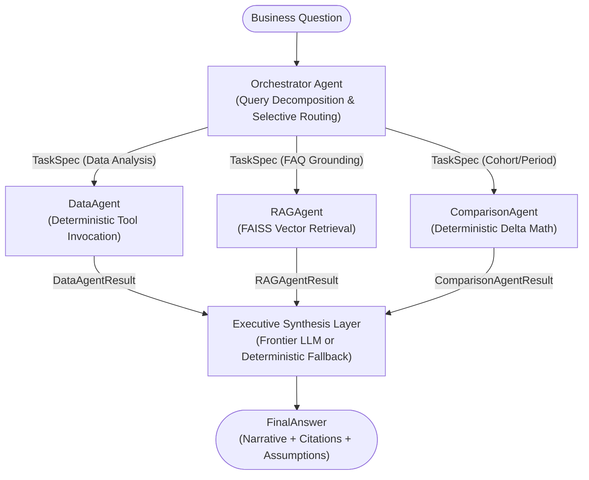

# MiniSense

MiniSense is an AI-powered survey intelligence system designed to analyze large customer feedback datasets, evaluate longitudinal sentiment shifts, and ground findings in company business policies. It couples a multi-agent orchestration architecture with pure deterministic Python analytics and local vector retrieval.

---

## Problem

Customer feedback analysis frequently suffers from two critical failure modes in standard LLM pipelines:
1. **Arithmetic Hallucinations**: Foundational language models routinely make errors when aggregating averages, percentages, and cohort differences across thousands of survey responses.
2. **Ungrounded Rationales**: When explaining feedback trends, generative models often invent operational causes rather than grounding explanations in verified enterprise service levels and FAQ policies.

MiniSense solves this by separating reasoning from arithmetic: all quantitative metrics are computed using deterministic Python tools, while qualitative explanations are strictly grounded in semantic knowledge base retrieval.

---

## Architecture

MiniSense implements a two-level multi-agent pipeline orchestrated with **LangGraph**:



---

## Agent Responsibilities

| Agent | Responsibility | Input | Output |
| :--- | :--- | :--- | :--- |
| **OrchestratorAgent** | Deconstructs incoming business questions into granular tasks; routes selectively without blind dispatching. | Raw query string, optional date/cohort filters | List of typed `TaskSpec` models |
| **DataAgent** | Executes survey filtering and calls registered analytics tools for aggregates and theme rankings. | `TaskSpec` with filter parameters | `DataAgentResult` (counts, CSAT, ratings, themes) |
| **RAGAgent** | Performs semantic similarity search over company policy and FAQ documents using local FAISS index. | `TaskSpec` with query text and $k$ parameter | `RAGAgentResult` (chunk text, chunk IDs, similarity scores) |
| **ComparisonAgent** | Compares metrics across distinct cohorts or temporal windows (e.g. Month-over-Month). | `TaskSpec` with baseline and comparison date ranges | `ComparisonAgentResult` (metric shifts, absolute & relative deltas) |
| **Synthesizer** | Assembles structured outputs into an executive response with explicit source citations and assumptions. | Combined results dictionary | `FinalAnswer` Pydantic payload |

---

## Data Generation

The dataset comprises **75,000 synthetic survey records** spanning April 1, 2026 to May 31, 2026, generated by [scripts/generate_data.py](file:///c:/Users/jkrid/OneDrive/Desktop/MiniSense/scripts/generate_data.py):
- **Deterministic & Reproducible**: Uses a fixed random seed (`seed=42`) with zero LLM API dependency.
- **Controlled Month-over-Month Variations**:
  - *Wait Time*: CSAT shifts from **13.5%** in April to **65.8%** in May (+52.3 percentage points) reflecting the introduction of May 1st express pickup lanes.
  - *App Experience*: CSAT shifts from **20.8%** in April to **69.8%** in May (+49.0 percentage points) simulating the App v2.0 update.
  - *Pricing*: CSAT drops from **44.5%** in April to **20.4%** in May (-24.1 percentage points) reflecting tier adjustments.
- **Controlled Distribution**: 36,886 records in April and 38,114 records in May distributed across 8 core themes (*Food Quality, Wait Time, Staff, Cleanliness, Pricing, Membership, Facilities, App Experience*).

---

## Analytics

All statistical and numerical operations are implemented as pure, testable Python functions in [app/tools/data_tools.py](file:///c:/Users/jkrid/OneDrive/Desktop/MiniSense/app/tools/data_tools.py):
- **CSAT Definition**:
  $$\text{CSAT} = \left( \frac{\text{Count}(\text{Rating} \ge 4)}{\text{Total Valid Ratings}} \right) \times 100$$
  Ratings of 4 and 5 are classified as satisfied; ratings 1, 2, and 3 are classified as unsatisfied.
- **Average Rating**: Exact arithmetic mean rounded to 2 decimal places.
- **Theme Analysis**: Aggregated by theme frequency, mean rating, CSAT percentage, and sentiment distribution.
- **Comparison Deltas**: Calculates absolute point differences and relative percentage changes, protected with zero-denominator safety guards.

---

## RAG (Retrieval-Augmented Generation)

- **Chunking Strategy**: Semantic question-answer chunks parsed from [data/faq.txt](file:///c:/Users/jkrid/OneDrive/Desktop/MiniSense/data/faq.txt) using `## Qx:` section delimiters. Each chunk contains a complete, self-contained business policy (50–100 words), avoiding sentence fragmentation.
- **Embedding Model**: `sentence-transformers/all-MiniLM-L6-v2` (384-dimensional dense vectors running locally on CPU).
- **Vector Store**: Local **FAISS** IndexFlatIP (Inner Product over normalized embeddings, equivalent to cosine similarity). Persisted locally in `data/faiss_index/`.
- **Top-K Retrieval & Confidence Gate**: Retrieves top-$k$ candidate chunks. A relevance confidence threshold ($0.35$) gates low-similarity matches; queries falling below threshold are flagged as `reliable=False` to prevent irrelevant context injection.

---

## Agent Communication

Agents do not pass free-form natural language strings between one another. All communication is strictly governed by immutable **Pydantic v2 schemas** in [app/models/schemas.py](file:///c:/Users/jkrid/OneDrive/Desktop/MiniSense/app/models/schemas.py):
- `TaskSpec`: Standardized sub-task definition issued by the Orchestrator.
- `DataAgentResult`: Quantitative aggregation payload.
- `RAGAgentResult`: Retrieved grounding chunks, chunk IDs, and similarity scores.
- `ComparisonAgentResult`: Baseline vs. current cohort metrics and deltas.
- `FinalAnswer`: Cohesive executive narrative, supporting metrics, chunk citations, and assumptions.

---

## Tool Calling

`DataAgent` implements an explicit internal tool registry and dispatches calls based on the incoming `TaskSpec`:

```
TaskSpec (task_type="top_themes", metric="csat")
                    │
                    ▼
           DataAgent.execute()
                    │
       ┌────────────┴────────────┐
       ▼                         ▼
filter_by_date()          get_top_themes()
                                 │
                                 ▼
                          compute_csat()
                                 │
                                 ▼
                         DataAgentResult
```

The LLM is completely excluded from performing numerical math.

---

## Sample Questions

Empirical execution outputs for benchmark questions are recorded in [evaluation/sample_questions.md](file:///c:/Users/jkrid/OneDrive/Desktop/MiniSense/evaluation/sample_questions.md):
1. *"What are the top 3 customer complaint themes in May?"* (Single-domain survey filtering)
2. *"How did CSAT and average rating change from April to May?"* (Month-over-month longitudinal comparison)
3. *"Why might wait-time complaints be increasing, and what does the business FAQ say about expected wait times?"* (Hybrid quantitative survey analysis + policy grounding)

Each record documents planner breakdown, intermediate agent outputs, retrieved FAQ chunks, and synthesized responses.

---

## Design Decisions & Trade-Offs

- **Deterministic Python vs. LLM Arithmetic**: All math is performed in pure Python. While an LLM can parse flexible mathematical requests, delegating calculations to code guarantees 100% precision and eliminates arithmetic hallucinations.
- **Local FAISS vs. Cloud Vector DB**: FAISS with `all-MiniLM-L6-v2` executes in-memory on CPU without external cloud services, network overhead, or API keys.
- **Selective StateGraph Routing vs. Monolithic Prompting**: LangGraph routes queries only to required sub-agents. A complaint inquiry invokes only `DataAgent`, while an FAQ inquiry invokes `RAGAgent`, reducing compute cost and eliminating context distraction.
- **Deterministic Synthesis Fallback**: If an external LLM API key is invalid or unavailable, the synthesizer automatically falls back to an internal deterministic templating engine, ensuring the system remains functional offline.

---

## Failure Handling

- **Missing or Empty Data**: When date filters return zero records, `data_tools` returns zeroed metrics (`csat=0.0`, `average_rating=0.0`, `response_count=0`) rather than raising divide-by-zero exceptions.
- **Low-Confidence Retrieval**: RAG queries below the $0.35$ cosine threshold flag `reliable=False`, preventing irrelevant policy hallucination.
- **Out-of-Domain / Malformed Queries**: The Orchestrator defaults to safe top-level metrics if a question cannot be decomposed into specific cohorts.

---

## Fine-Tuning Design (Domain Adaptation for 10,000 Surveys/Day)

### 1. Data Strategy & Curation
To adapt an efficient open model to 10,000 daily surveys, we construct a curated training set balancing domain expert audits (20%) with frontier-model teacher distillation (80% generated with GPT-4o / Claude 3.5 Sonnet using few-shot rubric validation). Sampling maintains strict class balance across all 8 feedback themes and sentiment polarities. Data is partitioned into a strict 70% train / 15% validation / 15% test split, stratified by theme, rating score (1–5), and date to eliminate temporal and topic leakage.

### 2. Dataset Sizing
The target dataset comprises **6,000 to 8,000 high-quality labeled examples** (~750–1,000 per theme). For a daily volume of 10,000 surveys, this volume adequately covers long-tail complaint expressions and multi-theme feedback while remaining cost-effective to annotate and audit.

### 3. Base Model Selection & Rationale
**Llama-3.1-8B-Instruct** (or **Mistral-7B-Instruct-v0.3**). 8B parameter models offer state-of-the-art instruction following, strong structured JSON compliance, and permissive licensing. Critically, 8B models fit entirely within 16GB–24GB VRAM (single NVIDIA L4 or A10G GPU), enabling high-throughput serving at sub-second latencies.

### 4. LoRA vs. QLoRA vs. Full Fine-Tuning
We adopt **16-bit LoRA (Low-Rank Adaptation)** with rank $r=16$, $\alpha=32$, and dropout $0.05$ across attention and MLP linear projections (`q_proj`, `k_proj`, `v_proj`, `o_proj`, `gate_proj`, `up_proj`, `down_proj`). Full fine-tuning is rejected due to excessive GPU compute costs ($>8\times$), risk of catastrophic forgetting, and inability to dynamically hot-swap adapters. QLoRA (4-bit NF4) is suitable for low-VRAM training but introduces dequantization latency penalties during low-latency serving. 16-bit LoRA provides optimal convergence speed, full fp16 serving throughput, and modular adapter weights (~65MB).

### 5. Tooling & Pipeline
Implemented with Hugging Face **TRL (`SFTTrainer`)**, **PEFT**, and **PyTorch**, accelerated by FlashAttention-2. Experiment metrics and loss curves are tracked via MLflow.
*Pipeline*: Schema validation $\rightarrow$ Tokenization with response-only loss masking (masking prompt tokens to evaluate cross-entropy exclusively on completion JSON) $\rightarrow$ 3-epoch training with cosine learning rate decay ($2 \times 10^{-4}$) $\rightarrow$ Validation evaluation every 250 steps $\rightarrow$ Signed adapter export to an internal artifact registry.

### 6. Evaluation Metrics & Readiness Criteria
- **Classification Performance**: Macro-F1 $\ge 0.90$ and per-class F1 $\ge 0.85$ across all 8 themes.
- **Frontier Model Parity**: Win/tie rate $\ge 92\%$ against GPT-4o in blinded LLM-as-a-judge evaluations.
- **Zero Math Hallucination**: 100% exact numerical match against input tool metrics.
- **Schema Reliability**: 100% valid Pydantic JSON parsing on 2,000 held-out test scenarios.
- **Latency & Cost SLA**: p99 inference latency $< 350\text{ms}$ on an NVIDIA L4 GPU; serving cost $<\$1.20$ per 10,000 responses (compared to $\approx \$25$–$\$40$ via frontier APIs).

### 7. Serving Architecture & Canary Rollout
Served via **vLLM** with dynamic multi-LoRA support. Rollout proceeds through a 7-day shadow phase (100% background mirroring against the frontier LLM) followed by a canary migration (5% $\rightarrow$ 25% $\rightarrow$ 100%). A circuit breaker automatically routes requests to the frontier model if output JSON parsing fails or confidence drops below $0.80$.

### 8. Future-Proofing Input/Output Contracts
All interactions remain strictly decoupled from model weights via semantic versioning of Pydantic contracts (`schema_version="2.0"`). New adapters are trained to conform to versioned schemas, allowing heterogeneous model versions to coexist safely in production.

---

## Setup

```bash
# 1. Clone repository and navigate to root
cd MiniSense

# 2. Install dependencies
pip install -r requirements.txt
```

---

## Configuration

Copy `.env.example` to `.env`:
```bash
cp .env.example .env
```

Available environment variables in [app/config.py](file:///c:/Users/jkrid/OneDrive/Desktop/MiniSense/app/config.py):
- `GEMINI_API_KEY`: API key for Google Gemini (optional; system operates autonomously with deterministic fallback if omitted).
- `LLM_PROVIDER`: LLM provider (`gemini` or `mock`).
- `DATA_PATH`: Path to survey dataset (defaults to `data/surveys.json`).
- `FAQ_PATH`: Path to FAQ text (defaults to `data/faq.txt`).
- `FAISS_INDEX_PATH`: Directory of saved FAISS index (defaults to `data/faiss_index/`).

---

## Run

### Build or Verify Index
```bash
python scripts/build_index.py
```

### CLI Queries
```bash
# Month-over-Month comparison
python -m app.main "How did CSAT and average rating change from April to May?"

# Complaint themes filtering
python -m app.main "What are the top 3 customer complaint themes in May?"

# Grounded policy explanation
python -m app.main "Why might wait-time complaints be increasing, and what does the business FAQ say about expected wait times?"

# Debug mode (displays planner decomposition and intermediate agent results)
python -m app.main --debug "How did CSAT change from April to May?"
```

---

## Test

Run all 45 automated unit and integration tests:
```bash
python -m pytest tests/ -v
```

Test coverage includes:
- `test_analytics.py`: Date filtering, CSAT, average ratings, top themes, period comparisons, empty inputs.
- `test_contracts.py`: Pydantic model serialization and validation.
- `test_data_agent.py`: DataAgent tool calling and error resilience.
- `test_comparison_agent.py`: Cohort comparison and delta math.
- `test_rag.py` & `test_rag_agent.py`: Local vector embedding, FAISS indexing, top-$k$ retrieval, threshold gating.
- `test_orchestrator.py`: LangGraph state machine, selective routing, and synthesis.
- `test_cli.py`: CLI arguments and output formatting.

---

## AI / External Resources Disclosure

In accordance with academic and engineering integrity standards:
- **LLM / API Usage**: Google Gemini (`gemini-1.5-flash`) via `google-genai` for executive synthesis. When no API key is provided, the system falls back to its deterministic synthesis engine.
- **Open-Source Libraries & Models**:
  - `sentence-transformers/all-MiniLM-L6-v2` (Apache-2.0) for local 384-dimensional text embeddings.
  - `faiss-cpu` for dense vector indexing.
  - `langgraph` and `langchain-core` for state-machine agent orchestration.
  - `pydantic` v2 for data contract validation.
- **Synthetic Data Generation**: The 75,000 survey records in `data/surveys.json` were generated using deterministic Python templates and pseudo-random distributions in `scripts/generate_data.py`. No external LLMs were used to generate survey records.
- **AI-Assisted Development**: Architecture design, boilerplate scaffolding, and test generation were assisted by the Antigravity AI coding assistant. All numerical formulas, schemas, and implementations were deterministically verified and validated by automated tests.
