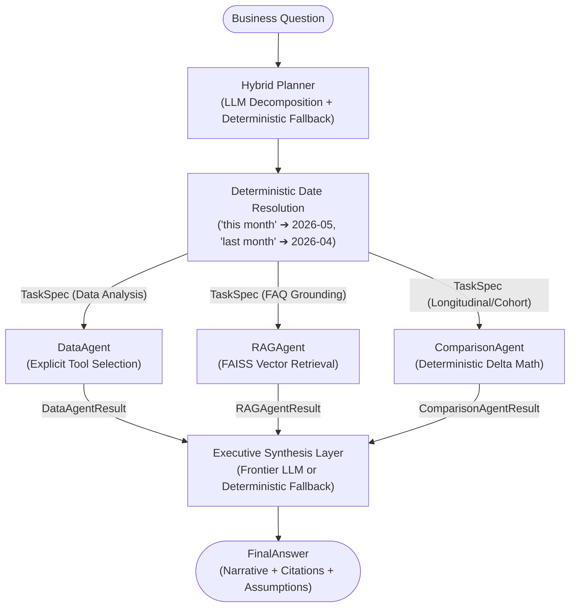

# MiniSense

MiniSense is an agentic survey intelligence system designed to analyze large-scale customer feedback datasets, compute longitudinal customer satisfaction shifts, and ground findings in company business policies. It couples a multi-agent orchestration architecture built with **LangGraph** and **Pydantic v2** contracts with pure deterministic Python analytics and local vector retrieval.

---

## 1. Problem Statement

Automated survey intelligence in enterprise customer operations faces two primary failure modes when relying on standard monolithic LLM pipelines:
1. **Arithmetic Hallucinations**: Generative language models routinely make numerical calculation errors when computing averages, CSAT percentages, and cohort deltas across thousands of survey responses.
2. **Ungrounded & Causal Hallucinations**: When explaining feedback trends, generative models often invent unsupported operational narratives rather than grounding explanations in verified enterprise service levels and FAQ policies, or erroneously claim causal proof from mere correlation.

MiniSense resolves these issues through strict separation of responsibilities:
- **Planning & Decomposition**: An LLM-powered hybrid planner interprets nuanced natural-language queries into validated structured task contracts.
- **Computation**: All arithmetic (CSAT, average ratings, response counts, delta calculations) is executed by pure deterministic Python functions.
- **Contextual Grounding**: Authoritative operational standards are retrieved via dense vector search over verified FAQ documentation.
- **Synthesis**: Multi-agent evidence is combined into an executive business narrative that clearly distinguishes measured survey data from operational policy context.

---

## 2. Architecture & Orchestration

MiniSense implements a two-level multi-agent pipeline orchestrated with **LangGraph**:



### Hybrid LLM Planner with Deterministic Date Resolution
The Orchestrator incorporates a hybrid planning engine:
- **LLM Decomposition**: The primary planner leverages structured outputs (OpenAI `beta.chat.completions.parse` or Gemini structured output) to interpret natural-language inquiries into a strictly validated `PlannerPlan` containing one or more `PlannedSubTask` entries.
- **Pydantic Validation**: Each planned task specifies `agent`, `task_type`, `metric`, `dimensions`, `filters`, `date_expression`, `comparison_period_expression`, `retrieval_query`, `requested_limit`, and `rationale`.
- **Deterministic Date Resolution**: Temporal expressions such as `"this month"`, `"last month"`, `"previous month"`, `"April"`, `"May"`, and `"June"` are converted deterministically into concrete ISO date ranges (`start_date`, `end_date`), anchoring May 2026 as the active evaluation window.
- **Deterministic Fallback Planner**: If an external LLM API key is unavailable, network requests fail, or the LLM emits malformed JSON, the orchestrator immediately switches to a deterministic fallback planner. The fallback is documented as an intentional reliability mechanism, ensuring uninterrupted offline execution.

---

## 3. Explicit Tool Usage & Separation of Concerns

The architecture strictly enforces separation of reasoning, selection, and arithmetic:

| Stage | Component | Responsibility |
| :--- | :--- | :--- |
| **WHAT to compute** | **Planner** | Interprets business inquiry semantics and decomposes intent into typed `TaskSpec`s. |
| **WHICH tool to call** | **DataAgent** | Inspects task requirements and dynamically invokes registered analytics tools. |
| **ARITHMETIC execution** | **Pure Python Tools** | Executes deterministic mathematical formulas without LLM involvement. |
| **DATA return** | **DataAgentResult** | Returns validated Pydantic model with `tools_called` logged in metadata. |

Deterministic computation eliminates LLM arithmetic variability and makes results reproducible and testable.

### Analytical Data Flow Architecture
MiniSense strictly isolates raw persisted data from analytical representations:
```
Raw Appendix-A record (9 persisted fields)
    ↓
Runtime Feature Derivation (classify_theme(free_text), derive_sentiment(rating))
    ↓
Deterministic Analytics Tools (compute_csat, compute_average_rating, get_top_themes)
```

### Deterministic Analytics Tools ([app/tools/data_tools.py](file:///c:/Users/jkrid/OneDrive/Desktop/MiniSense/app/tools/data_tools.py))
- `compute_csat(records)`: $\text{CSAT} = (\text{Count}(\text{Rating} \ge 4) / \text{Total Valid}) \times 100$
- `compute_average_rating(records)`: Exact arithmetic mean rounded to 2 decimal places.
- `count_responses(records)`: Total valid survey responses.
- `get_top_themes(records, top_n, metric)`: Theme aggregation supporting `negative_volume`, `worst_csat`, `best_csat`, and `volume`.
- `filter_by_date(records, start_date, end_date)`: Inclusive ISO date filtering based strictly on the Appendix A `date` field.
- `filter_surveys(records, response_channel, theme, business_id)`: Multi-dimensional segment filtering using Appendix A fields.

---

## 4. Dataset Specification (Appendix A Compliance)

The survey feedback dataset ([data/surveys.json](file:///c:/Users/jkrid/OneDrive/Desktop/MiniSense/data/surveys.json)) comprises **75,000 synthetic records** strictly conforming to the assignment's Appendix A schema:

```json
{
  "response_id": "r00001",
  "date": "2026-04-01",
  "business_id": "b01",
  "business_name": "GreenLeaf Bistro - Downtown Flagship",
  "survey_id": "s02",
  "survey_name": "Order Pickup & Wait Experience",
  "rating": 1,
  "response_channel": "kiosk",
  "free_text": "Line moved at a snail's pace; took 34 minutes from queue to counter pickup."
}
```

### Key Principles of the Dataset:
1. **Zero Pre-Labelled Ground Truth**: The raw records contain **only** the 9 fields required by Appendix A. No pre-computed labels (`theme`, `sentiment`, `csat_score`, `nps_score`, `category`, `cohort`) are stored.
2. **Dynamic Runtime Derivation**:
   - **Themes**: Deterministically classified at runtime from `free_text` via keyword/phrase taxonomy across 8 controlled themes: *Food Quality, Wait Time, Staff, Cleanliness, Pricing, Membership, Facilities, App Experience*.
   - **Sentiment**: Deterministically derived at runtime from `rating` ($1\text{–}2 \rightarrow \text{negative}$, $3 \rightarrow \text{neutral}$, $4\text{–}5 \rightarrow \text{positive}$).
3. **Lexical Diversity**: Free-text feedback is synthesized via combinatoric template slots (openers, specific menu items, complaint/praise nuances, and closers) across channels and dates, avoiding repetitive synthetic strings.
4. **Controlled Evaluation Signals**: The synthetic generator intentionally includes controlled temporal signals so that comparison and trend-analysis capabilities can be evaluated. Temporal signals are intentionally controlled synthetic evaluation signals and do not establish causal relationships.
5. **No Unsupported Causal Claims**: Operational policies in the FAQ (e.g. express pickup stations launched May 1) provide context for observed changes, but correlation is never misrepresented as causal proof.

---

## 5. RAG (Retrieval-Augmented Generation)

- **Source Document**: [data/faq.txt](file:///c:/Users/jkrid/OneDrive/Desktop/MiniSense/data/faq.txt) — GreenLeaf Bistro Customer Experience FAQ covering operational standards, wait-time targets, complaint escalation within 15 minutes, and allergen protocols.
- **Embeddings**: `sentence-transformers/all-MiniLM-L6-v2` (384-dimensional dense vectors running locally on CPU).
- **Vector Store**: Local **FAISS** index (`IndexFlatIP`) persisted in `data/faiss_index/`.
- **Natural-Language Query Passing**: The RAGAgent receives clean semantic queries generated by the LLM Planner (e.g., `"expected wait times peak off-peak policy"`).
- **Confidence Gating**: A similarity threshold ($0.35$) gates low-similarity matches; queries falling below this score are flagged as `reliable=False` to prevent irrelevant context injection.
- **Synthesis Formatting**: Grounded FAQ excerpts are cited by chunk ID in metadata, while the business narrative synthesizes operational guidance into clear executive prose without dumping raw markdown chunk headers.

---

## 6. Evaluation Scenarios & Benchmark Queries

MiniSense was empirically evaluated against the 3 required benchmark scenarios and 5 unseen natural-language queries. Full empirical traces are documented in [evaluation/sample_questions.md](file:///c:/Users/jkrid/OneDrive/Desktop/MiniSense/evaluation/sample_questions.md) and [evaluation/benchmark_runs.json](file:///c:/Users/jkrid/OneDrive/Desktop/MiniSense/evaluation/benchmark_runs.json):

### Required Benchmark Scenarios:
1. **Scenario 1 (Analytics / Ranking)**: *"What are the top 3 complaints this month?"*
   - Dynamically resolves May 2026 window; ranks themes by negative feedback count.
   - Top themes: Pricing (2,047 negative mentions), Membership (855), Facilities (793).
2. **Scenario 2 (Longitudinal Comparison)**: *"How did wait-time experience change from April to May?"*
   - Routes to `ComparisonAgent`; computes April vs. May metrics for Wait Time.
   - Result: CSAT improved from 12.51% to 60.95% (**+48.44 points**); average rating increased from 2.13 to 3.74 (**+1.61 stars**).
3. **Scenario 3 (Hybrid Analytics + RAG)**: *"How did wait-time experience change from April to May, and what does the FAQ say about expected wait times?"*
   - Tri-agent orchestration: `ComparisonAgent` computes deltas, `RAGAgent` retrieves `faq_chunk_2` (similarity score `0.441`).
   - Executive synthesis integrates metrics with operating standards (off-peak <10 min, peak 15–20 min) and notes May 1st express pickup stations as operational context without unsupported causal claims.

---

## 7. Fine-Tuning Design Proposal Summary

The full domain adaptation proposal for 10,000 surveys/day is documented in [DESIGN.md](file:///c:/Users/jkrid/OneDrive/Desktop/MiniSense/DESIGN.md) (Section 3).
- **Word Count**: Strictly **411 words** (satisfying the 300–500 word constraint).
- **Evaluation Criteria**: Uses standard classifier evaluation metrics (Macro-F1 $\ge 0.90$, per-class F1 $\ge 0.85$, precision, recall, multi-class confusion matrix, baseline comparison against heuristic regexes, and sub-50ms inference latency).
- **Technique**: 16-bit LoRA on Llama-3.1-8B-Instruct with Hugging Face TRL and vLLM dynamic adapter routing.

---

## 8. Setup & Installation

```bash
# 1. Clone repository and navigate to root
cd MiniSense

# 2. Install dependencies (Python 3.10+ supported; tested on Python 3.13)
pip install -r requirements.txt
```

---

## 9. Configuration & API Keys

MiniSense supports both OpenAI and Google Gemini models, as well as an autonomous offline fallback mode.

Create a `.env` file from `.env.example`:
```bash
cp .env.example .env
```

Available environment variables in [app/config.py](file:///c:/Users/jkrid/OneDrive/Desktop/MiniSense/app/config.py):
- `OPENAI_API_KEY`: API key for OpenAI (`gpt-4o-mini`).
- `GEMINI_API_KEY`: API key for Google Gemini (`gemini-1.5-flash`).
- `LLM_PROVIDER`: Provider selection (`openai`, `gemini`, or `mock`).
- `LLM_MODEL`: Target model name.

> **Security Note**: Never commit API keys to version control. The repository `.gitignore` excludes `.env` and all credential files.

### Running With and Without API Keys:
- **With API Key (`OPENAI_API_KEY` or `GEMINI_API_KEY`)**: The system utilizes the LLM Planner with structured Pydantic outputs and the frontier LLM synthesizer.
- **Without API Key / Offline Mode (`LLM_PROVIDER=mock`)**: The system automatically switches to the deterministic fallback planner and deterministic synthesizer. All tests and queries run without error.

---

## 10. Execution

### Build Vector Store Index
```bash
python scripts/build_index.py
```

### Interactive CLI
```bash
# Scenario 1: Top complaint themes
python -m app.main "What are the top 3 complaints this month?"

# Scenario 2: Longitudinal period comparison
python -m app.main "How did wait-time experience change from April to May?"

# Scenario 3: Hybrid analytics + RAG policy grounding
python -m app.main "How did wait-time experience change from April to May, and what does the FAQ say about expected wait times?"

# Debug mode (displays planner decomposition and intermediate agent results)
python -m app.main --debug "How did wait-time experience change from April to May?"
```

### Run All 8 Evaluation Scenarios
```bash
python -m scripts.run_benchmarks
```

---

## 11. Automated Test Suite

MiniSense includes a comprehensive test suite of **71 automated tests**:

```bash
python -m pytest tests/ -v
```

### Test Coverage Breakdown:
- `tests/test_v2_evaluation.py` (25 tests): Exact Appendix A schema, 50k–100k dataset size, dynamic theme/sentiment extraction, relative date resolution ("this month", "last month", named months), LLM planner structured validation, deterministic fallback, DataAgent tool invocation tracking, ComparisonAgent deltas, RAG natural-language retrieval, Scenario 3 hybrid flow, safe out-of-domain query handling, and the 12 mandatory production audit tests (date filtering using `date`, April/May non-zero partitions, theme keyword classification, sentiment derivation, non-collapsing theme aggregation, complaint negative volume ranking, channel and business filtering, schema invariance, and prohibition of derived labels).
- `tests/test_orchestrator.py` (5 tests): LangGraph state machine flow, selective routing, and executive synthesis.
- `tests/test_comparison_agent.py` (4 tests): Period deltas, channel comparison, zero-denominator safety guards.
- `tests/test_data_agent.py` (6 tests): Explicit tool invocation, theme rankings, channel filtering, date range handling.
- `tests/test_rag.py` & `tests/test_rag_agent.py` (11 tests): Chunking, FAISS indexing, similarity threshold gating, low-confidence flagging.
- `tests/test_analytics.py` (7 tests): CSAT, average ratings, response counting, complaint volume sorting.
- `tests/test_contracts.py` (5 tests): Pydantic contract validation, bounds enforcement, error handling.
- `tests/test_cli.py` (2 tests): Command-line argument parsing and output formatting.
- `tests/test_scaffold.py` (6 tests): SurveyService loading, retrieval, and agent scaffolding.

---

## 12. Integrity & External Resources Disclosure

- **LLMs & APIs**: OpenAI (`gpt-4o-mini`) and Google Gemini (`gemini-1.5-flash`) for planner decomposition and synthesis. Deterministic fallback engines provide 100% offline capability.
- **Open-Source Libraries**: `sentence-transformers/all-MiniLM-L6-v2` (Apache-2.0) for 384-dimensional dense text embeddings, `faiss-cpu` for dense indexing, `langgraph` and `langchain-core` for state-machine orchestration, `pydantic` v2 for typed contract enforcement.
- **Synthetic Data**: 75,000 records generated via deterministic Python templates and random distributions in `scripts/generate_data.py`. No external LLM was used to generate synthetic surveys.
